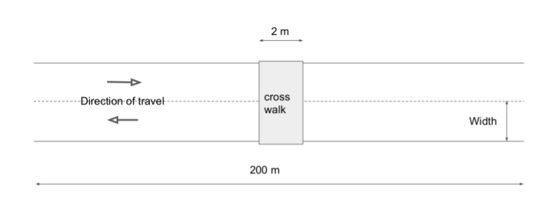
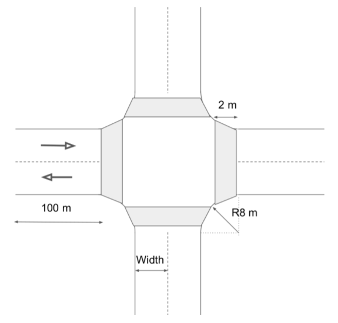

# maliput_xodr

OpenDRIVE resources for internal testing

## Map Templates

Templatized XODR files are provided for XODR description customizing.

The files are generated using the options selected via environment variable.

This is achieved using [empy](https://github.com/dirk-thomas/empy) tool. For installing:
```
pip install empy
```


### Straight Forward
Description:
 - 200m road.
 - Two lanes with opposite direction.




Options:
 - `CROSSWALK`: Adds a 2m-width crosswalk in the middle(s=100m).(default=`False`)
 - `WIDTH`: Width of the lanes(default 3m).
 - `X_OFFSET`: X offset with respect to the origin.
 - `Y_OFFSET`: Y offset with respect to the origin.

For generating a XODR file by using this template simply execute:

```sh
CROSSWALK=True WIDTH=4 empy3 templates/straight_forward.xml.em > generated_file.xodr
```

### Intersection
Description:
 - 4 road intersection.



Options:
 - `WIDTH`: Width of the lanes(default 3m).
 - `RADIUS`: Radius of the junction's border(default 8m).
 - `CROSSWALK`: Adds a crosswalk in each of the four sides of the intersection.(default=`False`)
 - `CROSSWALK_LENGTH`: Length of the crosswalk to be added if enabled.(default 2m)
 - `X_OFFSET`: X offset with respect to the origin.
 - `Y_OFFSET`: Y offset with respect to the origin.

For generating a XODR file by using this template simply execute:

```sh
WIDTH=4 RADIUS=8 CROSSWALK=True CROSSWALK_LENGTH=2 empy3 templates/intersection.xml.em > generated_file.xodr
```

## Resources

Example files with different values are provided under the `resources` folder. 
