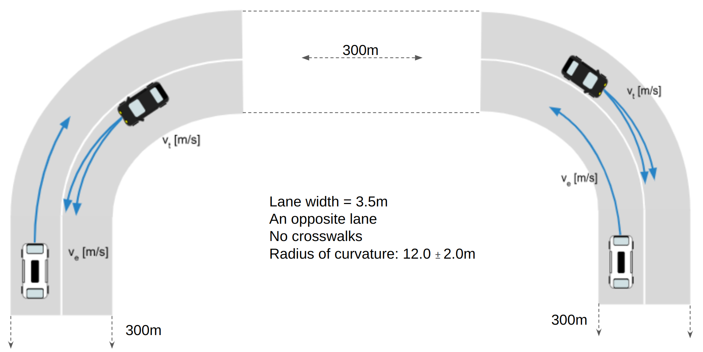
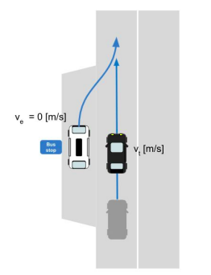

# maliput_xodr

OpenDRIVE resources for internal testing

## Map Templates

Templatized XODR files are provided for XODR description customizing.

The files are generated using the options selected via environment variable.

This is achieved using [empy](https://github.com/dirk-thomas/empy) tool. For installing it, and other dependencies:

```
pip install -r requirements.txt
```


### Straight Road
Description:
 - Variable-length road (e.g 200m).
 - Two lanes with opposite direction.
 - Optional:
    - A crosswalk in the middle
    - Stop lines before the crosswalk.


Options:
 - `LENGTH`: Length of the road(default=`500m`).
 - `WIDTH`: Width of the lanes(default=`3m`).
 - `CROSSWALK`: Adds a 2m-width crosswalk in the middle(s=`LENGTH`/2.).(default=`False`)
 - `CROSSWALK_LENGTH`: Length of the crosswalk.(default=`2m`)
 - `STOPLINE`: Adds stop lines before the crosswalk intersection .(default=`False`)
 - `STOPLINE_DISTANCE`: Distance from stop line to crosswalk. (default=`7m`)
 - `X_OFFSET`: X offset with respect to the origin.
 - `Y_OFFSET`: Y offset with respect to the origin.

For generating a XODR file by using this template simply execute:

```sh
CROSSWALK=True WIDTH=4 empy3 templates/straight_road.xml.em > generated_file.xodr
```

```sh
CROSSWALK=True STOPLINE=True LENGTH=200 WIDTH=4 empy3 templates/straight_road.xml.em > generated_file.xodr
```

### Intersection
Description:
 - 4 road intersection.


Options:
 - `WIDTH`: Width of the lanes(default 3m).
 - `RADIUS`: Radius of the junction's border(default 8m).
 - `CROSSWALK`: Adds a crosswalk in each of the four sides of the intersection.(default=`False`)
 - `CROSSWALK_LENGTH`: Length of the crosswalk to be added if enabled.(default 2m)
 - `STOPLINE`: Indicates if stoplines are generated(for east west directions only)(it only affects geoJSON info).(default=`False`)
 - `EXTENSIONS_LENGTH`: Indicates the length of the lead-in and lead-out roads(default 100m).
 - `X_OFFSET`: X offset with respect to the origin.
 - `Y_OFFSET`: Y offset with respect to the origin.

For generating a XODR file by using this template simply execute:

```sh
WIDTH=4 RADIUS=8 CROSSWALK=True CROSSWALK_LENGTH=2 empy3 templates/intersection.xml.em > generated_file.xodr
```

### T-Intersection
Description:
 - 3 road intersection


Options:
 - `WIDTH`: Width of the lanes(default 3.3m).
 - `RADIUS`: Radius of the junction's border(default 6m).
 - `EXTENSIONS_LENGTH`: Indicates the length of the lead-in and lead-out roads(default 50m).
 - `X_OFFSET`: X offset with respect to the origin.
 - `Y_OFFSET`: Y offset with respect to the origin.

For generating a XODR file by using this template simply execute:

```sh
WIDTH=3.3 RADIUS=6 empy3 templates/t_intersection.xml.em > generated_file.xodr
```

### Curved Road
Description:
 - 2 curved non-connected roads


Options:
 - `WIDTH`: Width of the lanes(default 3.5m).
 - `RADIUS`: Radius of the curved section(default 12m).
 - `LENGTH_STRAIGHT`: Length of the straight section(default 20m).
 - `GAP`: Distance between roads(default 1m).
 - `X_OFFSET`: X offset with respect to the origin.
 - `Y_OFFSET`: Y offset with respect to the origin.

```sh
LENGTH_STRAIGHT=25 RADIUS=15 GAP=5 empy3 templates/curved_road.xml.em > generated_file.xodr
```

### Curved Connected Roads
Description:
 - 2 curved roads connected by a straight road.



Options:
 - `WIDTH`: Width of the lanes(default 3.5m).
 - `RADIUS`: Radius of the curved section(default 12m).
 - `EXIT_ROAD_LENGTH`: Indicates the length of the straight section of the streets of the extremes(default 300m).
 - `MIDDLE_ROAD_LENGTH`: Indicates the length of the straight middle road(default 300m).
 - `X_OFFSET`: X offset with respect to the origin.
 - `Y_OFFSET`: Y offset with respect to the origin.

```sh
EXIT_ROAD_LENGTH=20 MIDDLE_ROAD_LENGTH=20 RADIUS=12 empy3 templates/curved_connected_roads.xml.em > generated_file.xodr
```

### Dedicated turn lane going South
Description:
 - Represents a T intersection with lanes going South to North, North to South, and West to North.
 - At the junction, the middle lane of the North-South road has a right turn to incorporate into the East to West corridor.
 - A stop line is added in the West side of the West-East corridor.


Options:
 - `WIDTH`: Width of the lanes (default 3.3m).
 - `RADIUS`: Radius of the curved section (default 6m).
 - `STOPLINE`: A boolean indicating whether to add the GeoJson stoplines (default True).
 - `X_OFFSET`: X offset with respect to the origin (default 0m).
 - `Y_OFFSET`: Y offset with respect to the origin (default 0m).
 - `EXTENSIONS_LENGTH`: Indicates the length of the lead-in and lead-out roads(default 100m).


```sh
WIDTH=3.3 STOPLINE=True RADIUS=6.0 empy3 templates/dedicated_southbound_right_turn_lane.xml.em > generated_file.xodr
```

### Bus Stop
Description:
 - A two-way road with a bus stop
   - Modelled as an extra lane of lane type: `special1`
 - geoJSON information is added for the bus stop lane only.



Options:
 - `WIDTH`: Width of the lanes(default 4m).
 - `EXTENSIONS_LENGTH`: Length of the outer lane sections(default 30m).
 - `BUS_STOP_LENGTH`: Length of the bus stop lane(default 15m).
 - `MERGE_LENGTH`: Length of the merge lane connecting to the bust stop lane (10m).
 - `X_OFFSET`: X offset with respect to the origin.
 - `Y_OFFSET`: Y offset with respect to the origin.

For generating a XODR file by using this template simply execute:

```sh
WIDTH=4 EXTENSIONS_LENGTH=30 BUS_STOP_LENGTH=15 MERGE_LENGTH=10 empy3 templates/bus_stop.xml.em > generated_file.xodr
```

## Resources

Example files with different values are provided under the `resources` folder.

## Standalone maps

Standalone maps that do not correspond to a particular template are added in the `standalone` folder.

 - [12_map_integration](standalone/12_map_integration/) map:
    A large-combined map was created out of the available `resources`.
    See [12_map_integration/README](standalone/12_map_integration/README.md) for more information about the map creation process.

    

