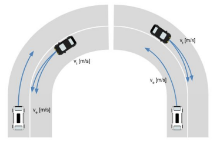

# maliput_xodr

OpenDRIVE resources for internal testing

## Map Templates

Templatized XODR files are provided for XODR description customizing.

The files are generated using the options selected via environment variable.

This is achieved using [empy](https://github.com/dirk-thomas/empy) tool. For installing it, and other dependencies:

```
pip install -r requirements.txt
```


### Straight Forward
Description:
 - 200m road.
 - Two lanes with opposite direction.


Options:
 - `LENGTH`: Length of the road(default 500m).
 - `WIDTH`: Width of the lanes(default 3m).
 - `CROSSWALK`: Adds a 2m-width crosswalk in the middle(s=100m).(default=`False`)
 - `X_OFFSET`: X offset with respect to the origin.
 - `Y_OFFSET`: Y offset with respect to the origin.

For generating a XODR file by using this template simply execute:

```sh
CROSSWALK=True WIDTH=4 empy3 templates/straight_forward.xml.em > generated_file.xodr
```

### Intersection
Description:
 - 4 road intersection.


Options:
 - `WIDTH`: Width of the lanes(default 3m).
 - `RADIUS`: Radius of the junction's border(default 8m).
 - `CROSSWALK`: Adds a crosswalk in each of the four sides of the intersection.(default=`False`)
 - `CROSSWALK_LENGTH`: Length of the crosswalk to be added if enabled.(default 2m)
 - `X_OFFSET`: X offset with respect to the origin.
 - `Y_OFFSET`: Y offset with respect to the origin.

For generating a XODR file by using this template simply execute:

```sh
WIDTH=4 RADIUS=8 CROSSWALK=True CROSSWALK_LENGTH=2 empy3 templates/intersection.xml.em > generated_file.xodr
```

### T-Intersection
Description:
 - 3 road intersection


Options:
 - `WIDTH`: Width of the lanes(default 3.3m).
 - `RADIUS`: Radius of the junction's border(default 6m).
 - `EXTENSIONS_LENGTH`: Indicates the length of the lead-in and lead-out roads(default 50m).
 - `X_OFFSET`: X offset with respect to the origin.
 - `Y_OFFSET`: Y offset with respect to the origin.

For generating a XODR file by using this template simply execute:

```sh
WIDTH=3.3 RADIUS=6 empy3 templates/t_intersection.xml.em > generated_file.xodr
```

### Curved Road
Description:
 - 2 curved non-connected roads



Options:
 - `WIDTH`: Width of the lanes(default 3.5m).
 - `RADIUS`: Radius of the curved section(default 12m).
 - `LENGTH_STRAIGHT`: Length of the straight section(default 20m).
 - `GAP`: Distance between roads(default 1m).
 - `X_OFFSET`: X offset with respect to the origin.
 - `Y_OFFSET`: Y offset with respect to the origin.

```sh
LENGTH_STRAIGHT=25 RADIUS=15 GAP=5 empy3 templates/curved_road.xml.em > generated_file.xodr
```

### Cross with turn lanes going North and South
Description:
 - Represents a cross with lanes going South to North (2), North to South (1), and West to East (1) and East to West (1).
 - At the junction, the middle lane of the North-South road has a right turn to incorporate into the West to East corridor.
 - Two stop lines are added in opposing corners of the West-East corridor.


Options:
 - `WIDTH`: Width of the lanes (default 4m).
 - `RADIUS`: Radius of the curved section (default 6m).
 - `STOPLINE`: A boolean indicating whether to add the GeoJson stoplines (default True).
 - `X_OFFSET`: X offset with respect to the origin (default 0m).
 - `Y_OFFSET`: Y offset with respect to the origin (default 0m).


```sh
WIDTH=4.0 STOPLINE=True RADIUS=6.0 empy3 templates/dedicated_turn_lanes_going_north_and_south.xml.em > generated_file.xodr
```

## Resources

Example files with different values are provided under the `resources` folder.

## Standalone maps

Standalone maps that do not correspond to a particular template are added in the `standalone` folder.

 - [12_map_integration](standalone/12_map_integration/) map:
    A large-combined map was created out of the available `resources`.
    See [12_map_integration/README](standalone/12_map_integration/README.md) for more information about the map creation process.

    
